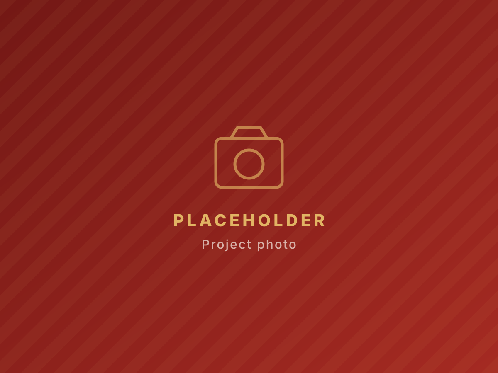

# Rotaract Club of Honiara — Website

The club's website. Plain HTML, CSS and JavaScript — no build step, no framework,
no software to install. If you can edit a text file, you can edit this site.

---

## Looking at the site

Double-click **`index.html`**. It opens in your browser. That's it — you're looking
at the real site exactly as visitors will.

After you change a file, save it and press **F5** in the browser to see the change.

---

## What's in here

```
index.html      Home
about.html      About Us
projects.html   Projects & Impact      <- the page donors and sponsors read
events.html     Events
leadership.html Our Leadership
join.html       Join Rotaract
news.html       News & Updates
gallery.html    Gallery
partners.html   Partners
contact.html    Contact + "Support Us"

css/style.css   All the styling. Colours and fonts are at the very top.
js/main.js      Menu, photo pop-up, filters, forms. Rarely needs touching.

assets/logo/    The club crest
assets/images/  All photos
```

---

## How to edit the words

Open any `.html` file in **Notepad** (Windows) or **TextEdit** (Mac), or better,
a free editor like [VS Code](https://code.visualstudio.com).

Find the text you want to change and type over it. Ignore everything wrapped in
angle brackets — that's the structure. Only change the words *between* them:

```html
<h3>[Project Name]</h3>     becomes     <h3>Clean Water at Burns Creek</h3>
```

### Adding another card, project, member or event

Every repeating block is marked with a comment telling you what it is:

```html
<!-- ===== PROJECT CARD — copy this whole block to add a project ===== -->
   ...the card...
<!-- ===== END PROJECT CARD ===== -->
```

**Copy everything between those two comment lines, paste it directly below, then
edit the copy.** Delete a whole block the same way to remove an item. This is the
pattern for project cards, member cards, event rows, news posts, gallery photos,
partner logos, timeline milestones and FAQs.

---

## Adding your own photos

1. Put the image file into `assets/images/`.
2. Find the placeholder it should replace and change the file name:

```html

```
becomes
```html

```

Two habits worth keeping:

- **Shrink photos before adding them.** Anything wider than about 1600 pixels is
  bigger than the site needs and makes the page slow on phone data. The free tool
  at [squoosh.app](https://squoosh.app) does this in your browser.
- **Always write the `alt` text.** It describes the photo for people using screen
  readers, and it shows if the image fails to load.

### Video

Don't put video files in `assets/`. Upload to YouTube or Facebook and embed the
video instead — step-by-step instructions are on the Gallery page itself, in the
box near the bottom.

---

## Changing the colours or fonts

Everything is defined once, at the top of `css/style.css`, and flows through the
whole site. Change a value there and every page updates.

```css
--maroon-deep: #4e0f0d;   /* darkest — hero + footer backgrounds */
--maroon:      #8c1c1a;   /* primary brand maroon */
--maroon-soft: #a52a22;   /* hover states */
--gold:        #c0912f;   /* accents on light backgrounds */
--gold-bright: #e8c06a;   /* accents + text on dark maroon */
--gold-pale:   #f3e2bc;   /* soft gold washes */
--cream:       #fcf7ee;   /* main page background */
--cream-2:     #f5ead9;   /* alternating sections */
--ink:         #3b2320;   /* body text (warm dark — deliberately not black) */
```

Fonts are a few lines below that: **Source Serif 4** for headings, **Inter** for
body text. No black is used anywhere as a core colour — that is deliberate, per
the club's brand direction.

---

## The logo

The club crest lives in `assets/logo/`:

- `logo.png` — 512x512, transparent background, used in the header and footer
- `favicon.png` — 180x180, the small icon in the browser tab

Both were exported from the club logo file with the area outside the circle made
transparent, so the crest sits cleanly on any background.

To replace them later, save new files under exactly those two names. Everything
else updates automatically. A square image with the crest centred works best — it
is displayed as a circle.

`logo-original.jpg` in the same folder is the untouched master file the crest was
exported from. Keep it — you will want it if the logo is ever needed at a
different size.

---

## Social media links

The club's Facebook, Instagram and TikTok links appear in four places on **every**
page: the thin bar above the menu, the mobile menu, the maroon strip near the
bottom, and the footer.

If a profile URL ever changes, use find-and-replace across all ten HTML files
(in VS Code: **Edit → Replace in Files**) rather than editing them one by one:

| Platform | Current link |
|---|---|
| Facebook | `https://www.facebook.com/RotaractHoniara/` |
| Instagram | `https://www.instagram.com/rotaractclubsi/` |
| TikTok | `https://www.tiktok.com/@officialrotaractclubofsi` |

To add another platform later, copy one of the existing links in each of those
four places and swap the URL, the label and the icon.

---

## BEFORE THE SITE GOES LIVE — placeholder checklist

Anything showing a gold **PLACEHOLDER** badge, or written in `[square brackets]`,
is fake and must be replaced. To find them all, search the folder for
`placeholder-note`.

> The logo and the Facebook, Instagram and TikTok links are **already real and
> live** — they are done. The club email address is still a placeholder.

- [ ] **Email address** — every page currently says `club-email@example.com`
- [ ] The seven **"Read more" links on `news.html`** still point nowhere (see the note on that page)
- [ ] **The four numbers** in the stats bar on `index.html` and `projects.html`
- [ ] **Mission and vision statements** on `about.html`
- [ ] **Club history milestones** on `about.html`
- [ ] **Sponsoring Rotary club and district number** on `about.html`
- [ ] **Real projects** with photos and outcomes on `projects.html`
- [ ] **Real events**, dates and venues on `events.html`
- [ ] **Member photos, names and roles** on `leadership.html` and `about.html`
- [ ] **Membership age range and fee** on `join.html`
- [ ] **Meeting day, time and venue** on `contact.html` and in every footer
- [ ] **Partner names and logos** on `partners.html` and `index.html`
- [ ] **Testimonial quotes, names and photos**
- [ ] Delete each `<span class="placeholder-note">...</span>` once you've dealt with it

> **Two things to be careful about:** ask each member before putting their photo
> and name on a public website, and get permission before publishing anyone's
> quote or photo. It is fine to leave someone off.

---

## How the contact forms work

There is **no payment system and no database** — deliberately. When someone submits
a form, it opens *their own* email app with the message already written, addressed
to the club. Nothing is sent to a third party, and nothing needs setting up.

**If you would rather have submissions land in an inbox automatically**, sign up
for a free form service such as [Formspree](https://formspree.io), or use Netlify
Forms (free if you host on Netlify — see below). Then, on each `<form>` tag:

1. Paste the endpoint they give you into `action="..."`.
2. Add `data-mailto="off"`.

The site's JavaScript then steps aside and the form posts to that service instead.
Full instructions are in the comments in `js/main.js`, section 7.

---

## Getting the site online

You need two things: a **domain** (the address people type) and **hosting** (where
the files live). They can come from the same company or from different ones.

### Hosting — all of these are free for a site like this

| Option | Good for | How it works |
|---|---|---|
| **Netlify Drop** | Fastest possible start | Go to `app.netlify.com/drop` and drag this whole folder onto the page. Live in about 30 seconds on a free `something.netlify.app` address. |
| **Cloudflare Pages** | Best speed in the Pacific | Similar drag-and-drop, on a very fast global network. Free. |
| **GitHub Pages** | If the club wants version history | These files are already in a Git repository. Push to GitHub, switch on Pages in the settings. Free. |

All three include free HTTPS (the padlock in the browser) automatically, and all
three let you connect your own domain later without moving anything.

**Recommendation:** start with **Netlify Drop** on the free address today. Show the
committee. Buy a domain once everyone is happy — it can be attached afterwards
without rebuilding anything.

### Domain — roughly what it costs

A domain is an annual fee, typically **USD $10–15 a year** for a `.com` or `.org`.
Reputable places to buy one: **Cloudflare Registrar** (sells at cost, usually
cheapest), **Namecheap**, or **Porkbun**.

A `.sb` (Solomon Islands) domain is possible but normally costs considerably more
and is more work to register — a `.org` is the easier choice unless the club
specifically wants the local one.

Once bought, the host you chose has a "custom domain" page with step-by-step
instructions. It is usually a matter of copying two settings across, then waiting
a little while for it to take effect.

### Updating the site once it is live

- **Netlify Drop / Cloudflare Pages:** drag the folder onto the site again — it
  replaces the old version.
- **GitHub Pages:** commit and push your changes; the site updates itself.

---

## A few things worth knowing

- The site works on phones, tablets and computers. Most visitors will arrive from
  the Instagram bio link on a phone, so **always check a change on a phone** before
  calling it done.
- The header, footer and menus are repeated inside each `.html` file. If you change
  the menu, change it in all ten files (find-and-replace across files makes this
  quick). This is deliberate — it keeps each page a single self-contained file that
  works on its own.
- The copyright year in the footer updates itself. Leave it as it is.
- If something breaks, the quickest fix is to undo your last change. Keep a copy of
  the folder before making big edits.
